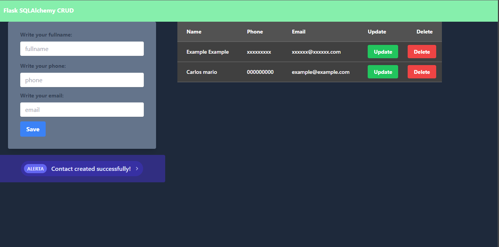

<h1 align="center">
    Flask Crud
</h1>

    
This is a project developed to practice Flask skills.

---

---

    <h1>Contact add</h1>

---

# How to run

---
You must have installed python 3.10 or latest
1. On App.py, in the line 7, config the URI to connect to you database
2. Run the bellow commands
* npm i
* pip install flask
* pip install SQLAlchemy
* python index.py

